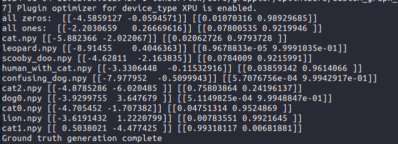
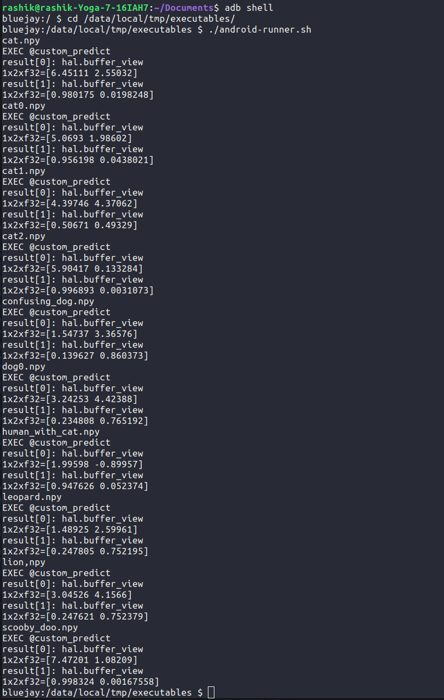

# reproduction steps 

## Prerequisities

- install tensorflow v2.14.1 ( Or higher )
- install tenworflow_datasets v4.9.4 (Or latest)
- have tf-opt , tf-mlir-translate, iree-opt, iree-compile, iree-run-module on system path ( iree-run-module should be built for android. The one included in this repo uses android-r25 ndk. If you device requires a different version of ndk build the iree-run-module using that and then use it) 

## Step 1: Get the ground-truth to compare against 

- run host_side_command.sh with any of the following parameters ```mobilenet, vgg16, resnet, densenet```
    - Example usage: ```bash host_side_command.sh mobilenet```
- The shell script will clear all existing directories, download the pretrained model weights, download the dataset, fine-tune the model for 2 epochs with the downloaded dataset, save the model. Then it will use tensorflow wrapper to sign the model and then run predictions on the signed model with the already included images in the images directory. It will print the output and this output is our ground truth. We expect the iree-compiled model to output values that are close to this ground truth output.

## Step 2: Compile

- run ```bash compile.sh```. Assuming you have ```tf-mlir-translate, tf-opt , iree-opt, iree-compile``` on path , it will execute the lowering commands one by one and put the iree executable in the ```executables``` directory


## Step 3: Push to android device and Run

- push to device by ```adb push ./executable /data/local/tmp```
- log into device shell ```adb shell```. If you have multiple devices use ```adb devices -l``` to get the device serial and then use ```adb -s [Device Serial] shell```
- cd to ```/data/local/tmp```
- make the shell command executable by running ```chmod +x android-runner.sh```
- run the shell command: ```./android-runner.sh```
- observe the differene between produced output and ground truth output from Step 1

### Output from TF 

### Output from IREE

